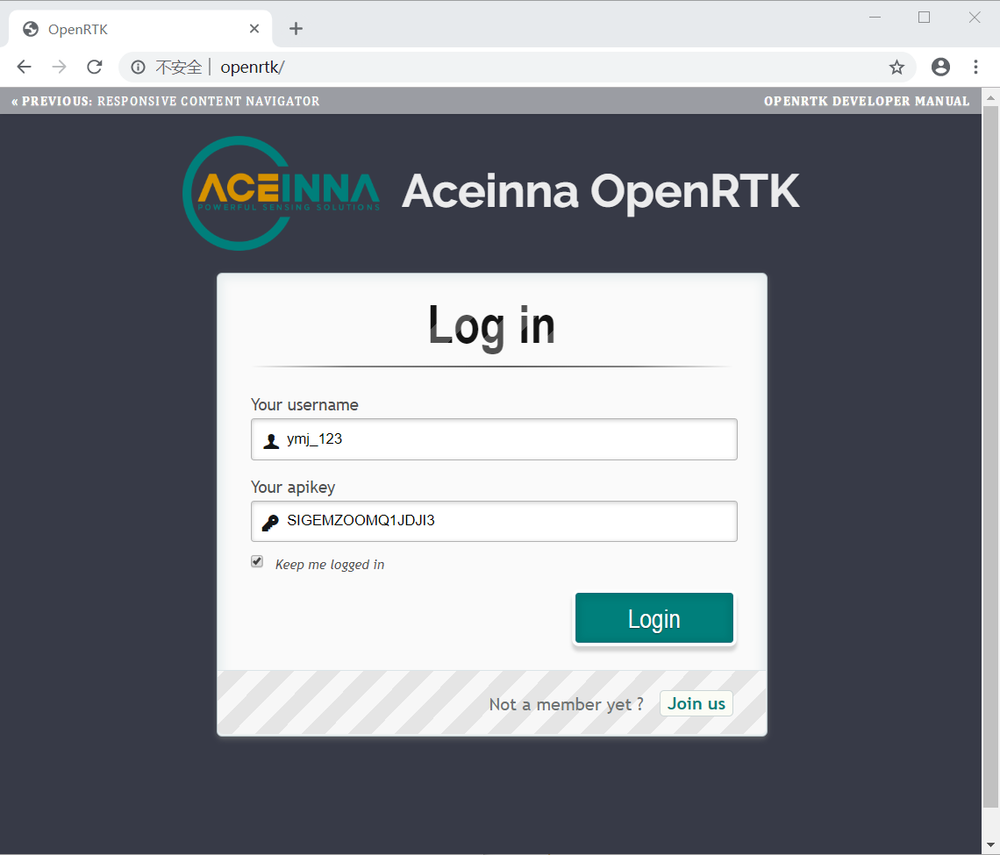
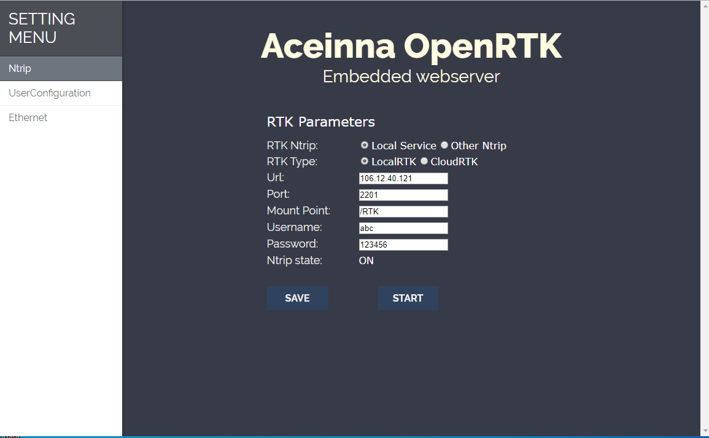
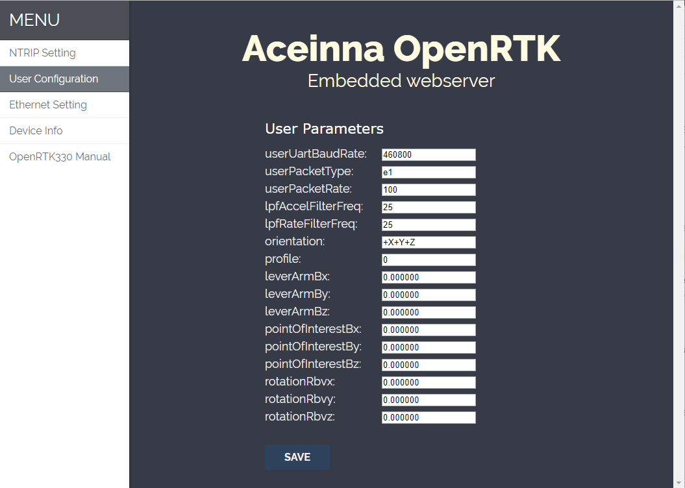
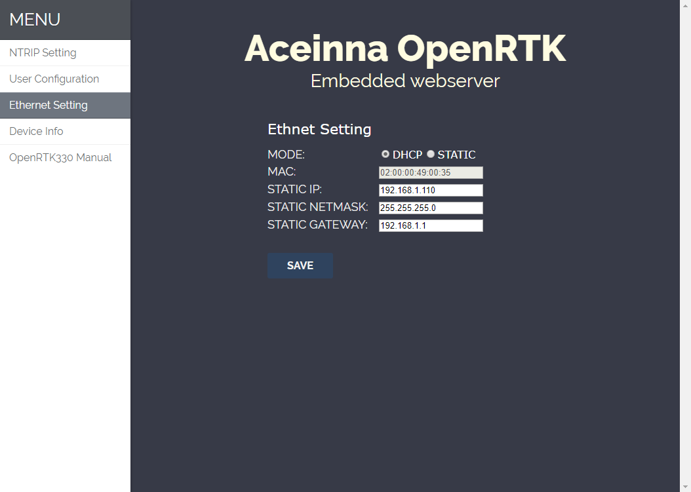
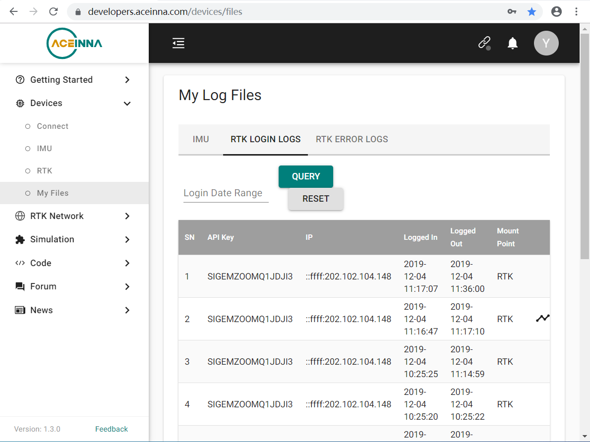

PC
===
::

Initial network
---------------

::

1. Plug in a RJ45 cable from the host(e.g. Router or Desktop) to the
   ethernet port of OpenRTK.
::

2. DHCP IP address is used by OpenRTK as default, if no success,
   manually setup a STATIC IP (ip = 192.168.1.110, netmask =
   255.255.255.0, gateway = 192.168.1.1).
::

3. Visit the embedded web site ("http://openrtk") on the same LAN as
   OpenRTK.

Example (use desktop) 
~~~~~~~~~~~~~~~~~~~~~
- 1.connect active wifi 
- 2.set the WLAN to share the network with ethernet, than the ethernet port will be used as a dhcp server 
- 3.connect openrtk with ethernet port

How to use
----------

1. **Sign up**. You need a account to login in. The account is same as
   Aceinna Developer Site and Aceinna Fourm. You can click 'Join us' to
   sign up your account.

2. **Generate API**. If you do not have the API key, you need generate API
   Key and set the number of allowed devices.

.. image:: ../media/signup.png
   :align: center
   :scale: 50%

3. **Ntrip Configuration**.

- RTK Ntrip: If you choose Local Service, ntrip client will use
  username and apikey in login. Otherwise, ntrip client will use
  username and password in ntripcfg.
- RTK Type: LocalRTK: get NEMA(GPGGA) from device,get RTCM from
  Aceinna server. cloudRTK: get RTCM from device, get NEMA(GPGGA)
  from Aceinna server.
- Ntrip state: ON: etnernet ntrip on, forbid bluetooth rtcm from
  mobile. OFF: ethernet ntrip off, allow bluetooth rtcm from mobile.
  state can be controlled by 'START' button.

4. **User Configuration**.

   -  change device setting, like baud rate, output packet and so on

5. **Ethernet Configuration**.

   -  IP mode: static ip or dhcp ip,if dhcp fail, it will use static ip.
   -  Static ip: include ip, netmask and gateway.
   -  RESTART: if dhcp over and fail, you can click "RESTART" to restart
      dhcp.

6. **Check**

   -  you can visit https://developers.aceinna.com/devices/files to see
      RTK LOGIN LOGS.
   -  you can also use mobile to see #GPGGA.

